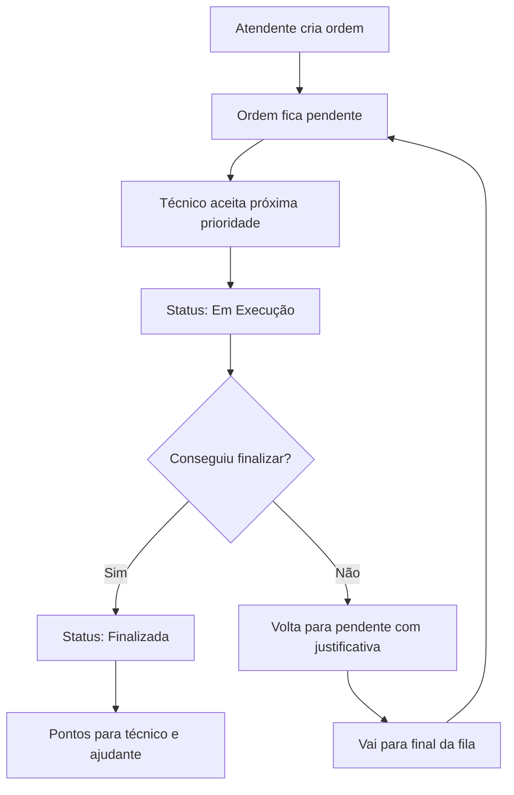

# Like Telecom - Sistema de Gestão de Ordens de Serviço


## 📋 Sobre o Projeto

O Sistema de Gestão de Ordens de Serviço da Like Telecom é uma aplicação web responsiva desenvolvida para otimizar o fluxo de trabalho de uma empresa de telecomunicações. O sistema permite o controle completo de ordens de serviço, desde a criação até a finalização, com diferentes níveis de acesso para administradores, atendentes, técnicos e ajudantes.

## ✨ Funcionalidades Principais

### 🔐 Sistema de Autenticação
- **4 tipos de usuário**: Admin, Atendente, Técnico e Ajudante
- **Controle de permissões** diferenciado por tipo de usuário
- **Sessões seguras** com renovação automática
- **Interface de login** moderna e responsiva

### 📊 Dashboard Inteligente
- **Métricas em tempo real**: ordens pendentes, em execução e finalizadas
- **Rankings mensais** de técnicos e ajudantes
- **Gráficos de desempenho** e produtividade
- **Atualização automática** das informações

### 📋 Gestão de Ordens de Serviço
- **3 tipos de ordem** com pontuações específicas:
  - 🔧 **Instalação**: 5 pontos
  - 🛠️ **Suporte**: 3 pontos
  - 📦 **Remoção de Kit**: 1 ponto
- **Sistema de prioridades** automático
- **Workflow completo**: Pendente → Em Execução → Finalizada
- **Filtros avançados** por status, tipo e técnico

### 🏆 Sistema de Pontuação
- **Pontuação automática** para técnicos e ajudantes
- **Rankings mensais** com identificação do técnico/ajudante do mês
- **Histórico de desempenho** por período
- **Incentivo à produtividade** baseado em métricas claras

### 📅 Calendário com Feriados
- **Bloqueio automático** de feriados nacionais
- **Validação de datas** para agendamento
- **Interface visual** para seleção de datas
- **Impedimento de agendamento** em datas inválidas

### 👥 Controle de Usuários
- **Cadastro e edição** de usuários (apenas Admin)
- **Controle de status** (ativo/inativo)
- **Gerenciamento de permissões** por tipo de usuário

## 🚀 Tecnologias Utilizadas

### Frontend
- **HTML5** - Estrutura semântica
- **TailwindCSS** - Framework CSS utilitário
- **JavaScript ES6+** - Funcionalidades interativas
- **FontAwesome** - Ícones modernos

### Arquitetura
- **Vanilla JavaScript** - Sem dependências de frameworks
- **LocalStorage** - Armazenamento local de dados
- **Modular Design** - Código organizado em módulos
- **Responsive Design** - Interface adaptável para todos os dispositivos

### Preparação para Backend
- **API Ready** - Estrutura preparada para integração com backend
- **Modular Data Management** - Fácil migração para banco de dados
- **RESTful Architecture** - Endpoints organizados e documentados

## 📁 Estrutura do Projeto

```
like-telecom-sistema/
├── index.html              # Página principal da aplicação
├── css/
│   └── style.css           # Estilos customizados e variáveis CSS
├── js/
│   └── script.js           # Lógica principal da aplicação
├── README.md               # Documentação do projeto
└── .gitignore             # Arquivos ignorados pelo Git
```

### 🗂️ Organização dos Arquivos JavaScript

O arquivo `script.js` está organizado em módulos bem definidos:

- **CONFIG**: Configurações globais e constantes
- **AppState**: Estado da aplicação
- **Utils**: Funções utilitárias
- **DataManager**: Gerenciamento de dados (LocalStorage)
- **AuthManager**: Sistema de autenticação
- **OrderManager**: Gestão de ordens de serviço
- **UserManager**: Gerenciamento de usuários
- **NotificationManager**: Sistema de notificações
- **CalendarManager**: Calendário com feriados
- **UIManager**: Controle da interface

## 🔧 Instalação e Configuração

### Pré-requisitos
- Navegador web moderno (Chrome, Firefox, Safari, Edge)
- Servidor web local ou hospedagem web

### Instalação Local

1. **Clone ou baixe o projeto**:
   ```bash
   git clone https://github.com/seu-usuario/like-telecom-sistema.git
   cd like-telecom-sistema
   ```

2. **Inicie um servidor local**:

   **Opção 1 - Python:**
   ```bash
   python -m http.server 8000
   ```

   **Opção 2 - Node.js:**
   ```bash
   npx serve .
   ```

   **Opção 3 - PHP:**
   ```bash
   php -S localhost:8000
   ```

3. **Acesse no navegador**:
   ```
   http://localhost:8000
   ```

### Hospedagem Web

#### Hospedagem Gratuita
- **Netlify**: Arraste a pasta do projeto para netlify.com/drop
- **Vercel**: Conecte o repositório GitHub
- **GitHub Pages**: Configure nas configurações do repositório

#### Hospedagem Paga
- **Hostinger**: Upload via FTP/cPanel
- **UOL Host**: Upload via painel de controle
- **Locaweb**: Upload via gerenciador de arquivos

## 👤 Usuários Padrão

O sistema vem com usuários pré-cadastrados para teste:

| Tipo | Email | Senha | Descrição |
|------|-------|-------|-----------|
| **Admin** | admin@liketelecom.com | 123456 | Acesso total ao sistema |
| **Atendente** | maria@liketelecom.com | 123456 | Criar e gerenciar ordens |
| **Técnico** | joao@liketelecom.com | 123456 | Executar ordens de serviço |
| **Técnico** | pedro@liketelecom.com | 123456 | Executar ordens de serviço |
| **Ajudante** | carlos@liketelecom.com | 123456 | Auxiliar técnicos |

> ⚠️ **Importante**: Altere as senhas padrão antes de usar em produção!

## 🎯 Como Usar

### Para Administradores
1. Faça login com credenciais de admin
2. Acesse "Usuários" para gerenciar a equipe
3. Monitore o dashboard para métricas gerais
4. Visualize rankings e relatórios

### Para Atendentes
1. Faça login com credenciais de atendente
2. Acesse "Ordens de Serviço" → "Nova Ordem"
3. Preencha os dados do cliente e serviço
4. Use "Gerenciar Prioridades" para reordenar ordens

### Para Técnicos
1. Faça login com credenciais de técnico
2. Visualize apenas a próxima ordem na fila de prioridade
3. Clique "Aceitar" para iniciar o atendimento
4. Selecione um ajudante (opcional)
5. Finalize a ordem ou retorne para pendente se necessário

### Para Ajudantes
1. Faça login com credenciais de ajudante
2. Visualize apenas ordens onde está designado
3. Acompanhe o técnico responsável

## 🔒 Permissões por Tipo de Usuário

| Funcionalidade | Admin | Atendente | Técnico | Ajudante |
|---|:---:|:---:|:---:|:---:|
| **Dashboard Completo** | ✅ | ✅ | ❌ | ❌ |
| **Criar Ordens** | ✅ | ✅ | ❌ | ❌ |
| **Ver Todas as Ordens** | ✅ | ✅ | ❌ | ❌ |
| **Gerenciar Prioridades** | ✅ | ✅ | ❌ | ❌ |
| **Ver Rankings** | ✅ | ✅ | ❌ | ❌ |
| **Aceitar Ordens** | ✅ | ❌ | ✅ | ❌ |
| **Executar Ordens** | ✅ | ❌ | ✅ | ✅* |
| **Cadastrar Usuários** | ✅ | ❌ | ❌ | ❌ |
| **Relatórios** | ✅ | ✅ | ❌ | ❌ |

*Ajudante só participa quando designado pelo técnico

## 🔄 Fluxo de Trabalho



## 🎨 Personalização

### Cores da Marca
As cores podem ser alteradas no arquivo `css/style.css`:

```css
:root {
    --brand-blue: #0A2463;    /* Cor principal */
    --brand-orange: #FF7F11;  /* Cor de destaque */
    --brand-light: #F8F8F8;   /* Fundo */
}
```

### Pontuação dos Serviços
Altere no arquivo `js/script.js`:

```javascript
ORDER_TYPES: {
    installation: { name: 'Instalação', points: 5 },
    support: { name: 'Suporte', points: 3 },
    removal: { name: 'Remoção de Kit', points: 1 }
}
```

### Feriados
Adicione ou remova feriados em `CONFIG.HOLIDAYS_2024`.

## 🔮 Integração com Backend

O sistema está preparado para integração com backend. Para conectar a uma API:

### 1. Configurar URL da API
```javascript
const CONFIG = {
    API_BASE_URL: 'https://sua-api.com/api'
};
```

### 2. Implementar Funções de API
```javascript
const ApiManager = {
    async get(endpoint) {
        const response = await fetch(`${CONFIG.API_BASE_URL}${endpoint}`);
        return response.json();
    },

    async post(endpoint, data) {
        const response = await fetch(`${CONFIG.API_BASE_URL}${endpoint}`, {
            method: 'POST',
            headers: { 'Content-Type': 'application/json' },
            body: JSON.stringify(data)
        });
        return response.json();
    }
};
```

### 3. Substituir LocalStorage
Substitua chamadas do `DataManager` por `ApiManager` nos módulos.

## 🐛 Troubleshooting

### Problemas Comuns

**1. Sistema não carrega**
- Verifique se está acessando via servidor web (não file://)
- Confirme se todos os arquivos estão no local correto

**2. Login não funciona**
- Verifique se o LocalStorage está habilitado
- Confirme as credenciais padrão

**3. Interface quebrada**
- Verifique conexão com internet (TailwindCSS e FontAwesome via CDN)
- Confirme se o CSS customizado está carregando

**4. Dados perdidos**
- Os dados são salvos no LocalStorage do navegador
- Limpar cache remove todos os dados

### Debug Mode
Para ativar modo debug, abra o console do navegador e execute:
```javascript
window.LikeTelecom.CONFIG.DEBUG = true;
```

## 📈 Roadmap Futuro

### Versão 1.1
- [ ] Módulo de relatórios avançados
- [ ] Integração com WhatsApp Business API
- [ ] Sistema de notificações push
- [ ] Backup automático de dados

### Versão 1.2
- [ ] Aplicativo mobile (PWA)
- [ ] Integração com Google Maps
- [ ] Sistema de avaliação de clientes
- [ ] Chat interno entre equipes

### Versão 2.0
- [ ] Backend completo com Node.js
- [ ] Banco de dados PostgreSQL
- [ ] API RESTful documentada
- [ ] Sistema de autenticação JWT

## 🤝 Como Contribuir

1. **Fork** o repositório
2. Crie uma **branch** para sua feature (`git checkout -b feature/AmazingFeature`)
3. **Commit** suas mudanças (`git commit -m 'Add some AmazingFeature'`)
4. **Push** para a branch (`git push origin feature/AmazingFeature`)
5. Abra um **Pull Request**

### Padrões de Código
- Use **ESLint** para JavaScript
- Siga os padrões de **nomenclatura** existentes
- **Documente** funções importantes
- **Teste** em diferentes navegadores

## 📄 Licença

Este projeto está sob a licença MIT. Veja o arquivo [LICENSE](LICENSE) para detalhes.

## 👥 Autores

- **Equipe Like Telecom** - *Desenvolvimento inicial* - [LikeTelecom](https://github.com/liketelecom)

## 🙏 Agradecimentos

- **TailwindCSS** pela framework CSS
- **FontAwesome** pelos ícones
- **MDN Web Docs** pela documentação
- **GitHub** pela hospedagem do código

---

**🌟 Se este projeto foi útil, deixe uma estrela no GitHub!**

Para suporte técnico, entre em contato: [support@liketelecom.com](mailto:support@liketelecom.com)
